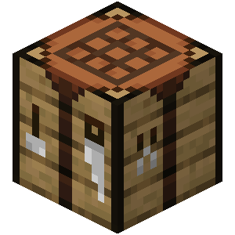

# Craftable

> Craft what you can, from what you have.

Craftable is a streamlined crafting enhancement mod for Minecraft which allows players to perform any sequence of operations in a single explicit action, as long as those operations could already be completed manually using the resources and workstations available in the current environment, while preserving the vanilla experience without introducing storage networks, new blocks, technology trees, or additional resource systems.

---

### Downloads

#### Stable builds

The lastest stable release of Craftable can be downloaded from our official [Modrinth](https://modrinth.com/project/craftable-mod) pages.

### Installation

Both _NeoForge_ and _Fabric_ mod loaders are supported.

For more information about downloading and installing the mod, please refer to our [official Discord server](https://discord.gg/ACyktx3Je).

### Reporting Issues

If you do not need technical support and would like to report an issue (bug, crash, etc.) or otherwise request changes
(for mod compatibility, new features, etc.), then we encourage you to open an issue on the
[project issue tracker](https://github.com/BeRusted/Craftable/issues).

### Join the Community

We have an [official Discord community](https://discord.gg/ACyktx3Je) for all of our projects. By joining, you can:
- Get installation help and technical support for all of our mods
- Get the latest updates about development and community events
- Talk with and collaborate with the rest of our team
- ... and just hang out with the rest of our community.